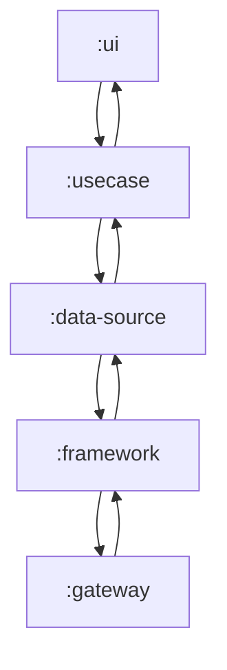

# Android Project Documentation — Parsa Dehghan

# Project Overview

This Android project implements modern development practices through a feature-based, multi-modular architecture.

## Technical Stack

- **UI Framework:** Jetpack Compose - Modern declarative UI toolkit
- **Dependency Injection:** Hilt - Simplified DI implementation for Android
- **Architecture:** Multi-module by feature - Clean Architecture

## Project Structure

### Modules Organization

- :app - Main application module
- :base - Core conventions including BaseDomain, UseCase, and ErrorHandler
- :core - Shared Models
- :navigator - Intermediate module for handling navigation
- :resources - Shared resources between modules
- :gateway - Handles remote data interactions
- :people - People feature module
- :buildLogic - Gradle DSL for improved module creation—apply plugins to easily create new modules

## Navigator

There are many ways to implement navigation in Compose, and it becomes especially complex in a multi-modular project. So why did I choose this approach?

The navigation flow (like moving from screen A to B) is handled through callbacks. I designed it this way to minimize dependencies. If I had passed the NavController to composables for direct navigation, the modules would be tightly coupled to both hardcoded destinations and the navigator. With the current approach, modules are portable—you can copy and paste them for use in other projects.

## How are feature sub-modules structured?

Each feature contains 5 modules, with two Android modules and three pure Kotlin modules.

You might wonder:

Why are the usecase and domain modules separate? I'm using a BaseDomain interface that's implemented by all models throughout the project. In some cases (like this one), the usecase doesn't depend on domain. When there's no dependency between modules, it makes sense to keep them separate.
## Feature Module Dependencies

